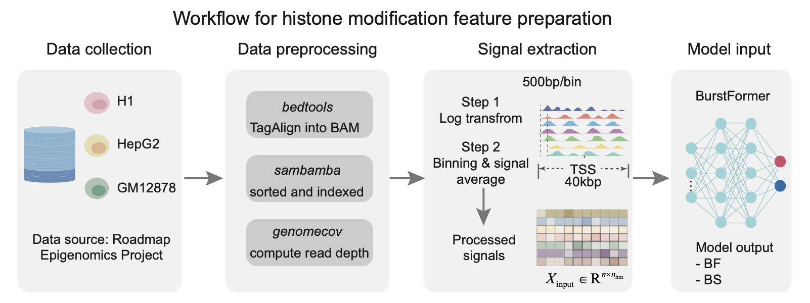
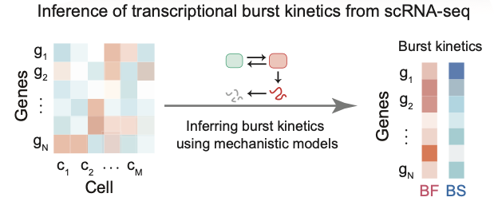
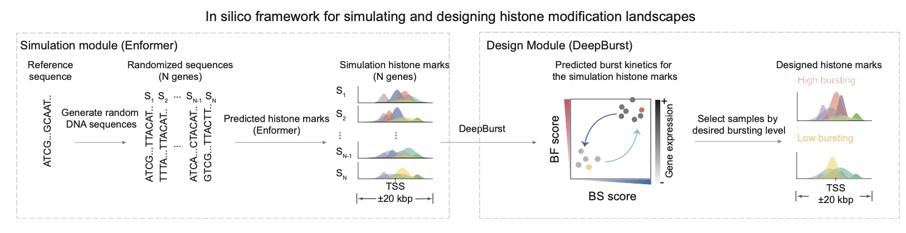

<p align="center">
  
</p>

# **Project at a glance**

DeepBurst is a Transformer-based framework for predicting transcriptional bursting kinetics from promoter-centred histone modification profiles. Given a TSS-centred 40 kb window (80 bins at 500 bp) and seven ChIP–seq tracks (H3K9ac, H3K27ac, H3K4me3, H3K4me1, H3K36me3, H3K27me3, H3K9me3), DeepBurst learns position-aware chromatin representations and jointly classifies **burst frequency (BF)** and **burst size (BS)** into high/low regimes.

**Key facts**

- **Genome build:** hg19
- **Input:** 40 kb TSS-centred window, binned at 500 bp (80 bins) across 7 histone marks
- **Output:** per-gene predicted probabilities for **high BF** and **high BS**
- **Labels:** bursting parameters inferred from matched scRNA-seq and binarized by **within–cell line median thresholds**
- **Evaluation:** **cell-type-specific** training with **4-fold chromosome-split cross-validation**


**Downstream uses**


- Genome-wide bursting-state prediction from histone profiles
- Attribution-based interpretation of informative marks and genomic positions
- Model-constrained *in silico* perturbation analyses to prioritize epigenomic changes predicted to shift bursting regimes

# Quickstart

## **Installation**

Clone the repository:

```
git clone https://github.com/wanghan4034/DeepBurst.git
cd DeepBurst
```

Create an environment and install dependencies:

```
conda create -n deepburst python=3.10
conda activate deepburst
pip install -r requirements.txt
```

For GPU support, install PyTorch following the official instructions and ensure CUDA is compatible with your system.


## **Option A: Inference with a pretrained checkpoint (recommended)**

1. Download the processed dataset and pretrained checkpoints from **Zenodo**:

- Releases page: 10.5281/zenodo.18219742
- Assets to download (example names; adjust to your release assets):
  - deepburst_processed_data.zip
  - deepburst_checkpoints.zip


1. Unzip and run inference:

```
python scripts/demo_infer.py \
  --eid E003 \
  --ckpt checkpoints/E003.0.bs_bf_para.model.pt \
  --meta extra/datasets/processed/E003_samples/meta_data_E003_samples.csv \
  --npy_dir extra/datasets/processed/E003_samples \
  --fold 0 \
  --out extra/results/E003.fold0.infer.csv
```


## **Option B: Train from processed data**

```
python train.py \
  --config configs/default.yaml \
  --meta extra/datasets/processed/v2/meta_datasets/meta_data_E003.csv \
  --npy-dir extra/datasets/processed/v2 \
  --fold 0 \
  -o checkpoints/E003.0.bs_bf_para.model.pt
```


# **Repository layout**

- src/ core model and utilities
- scripts/ demo, analysis, and figure-generation scripts
- configs/ YAML configs for training/inference
- checkpoints/ pretrained models (download from Zenodo)
- extra/datasets/ processed data, gene annotations, and resources (download from Zenodo)

# **Full pipeline**

## **Data preprocessing**

This repository provides preprocessing scripts for constructing model-ready datasets by integrating:

- **Histone modification features** (Roadmap TagAlign / coverage tracks)
- **Bursting labels** (BF and BS derived from scRNA-seq kinetic inference)

Cell lines are indexed using Roadmap Epigenomics **EID** identifiers:

- **E003**: H1
- **E118**: HepG2
- **E116**: GM12878


## **Dependencies**

### **Python (feature generation, training, and analysis)**

- Python 3.10
- Dependencies in requirements.txt

### **Command-line tools (histone preprocessing)**

- bedtools 2.31.1
- sambamba 1.0.1


### **Julia (optional; DeepTX-based kinetic inference)**

If you use the DeepTX label-generation path, install Julia ≥ 1.7.3 and required packages (see src/data_preprocessing/label_generation/).

## **Histone modification feature generation**



### **Step 1 — Download and preprocessing**

We download Roadmap **TagAlign** files and convert them to BAM using **bedtools** (bedtools 2.31.1), providing the UCSC hg19 chromosome size file to ensure consistency of chromosome names and lengths; TagAlign files are treated as single-end alignments. BAM files are sorted and indexed with **sambamba** (1.0.1). We then compute genome-wide, base-resolution coverage in **hg19** using bedtools genomecov, and transform coverage using the same log transform used for model inputs (base *e*) prior to downstream binning.This workflow is encapsulated in src/data_preprocessing/Snakefile and can be executed with:

```
snakemake -s src/data_preprocessing/Snakefile -j 8
```

### **Step 2 — Per-gene feature extraction**

Example for **H1 (E003)**:

```
python src/data/data_process.py \
  --eid E003 \
  --gene extra/datasets/genomic/hg19/genes.bed \
  --epi_dir extra/datasets/epigenetic/hg19 \
  -o extra/datasets/processed/v2
```


## **Burst label generation**

Burst frequency and burst size are inferred from scRNA-seq UMI counts and then converted into binary labels.

<p align="center">
  
</p>

### **Step 1 — Infer bursting kinetics (choose one)**

**txburst**

```bash
python src/data_preprocessing/label_generation/txburst/txburst_infer.py --cell_type H1
```

**DeepTX (Julia)**

```bash
julia TX_inferrer.jl data/H1_scRNA.csv inferred_results.csv
```

### **Step 2 — Convert kinetics into BF/BS labels**

```
python src/data/burst/data_convert.py \
  --eid E003 \
  --gene_id2neighbors extra/datasets/processed/v2/E003/gene_id2neighbors_E003.csv \
  -o extra/datasets/processed/v2/meta_datasets
```


# **Model training and prediction**

## **Training (4-fold chromosome-split cross-validation )**


Example loop for **E003,  fold 0**:

```
eid=E003
fold=0
python train.py \
  --config configs/default.yaml \
  --meta extra/datasets/processed/v2/meta_datasets/meta_data_${eid}.csv \
  --npy-dir extra/datasets/processed/v2 \
  --fold $fold \
  -o checkpoints/${eid}.${fold}.bs_bf_para.model.pt 
```

More scripts for analysis and figure generation are under:

- scripts/analysis/
- scripts/figures/

# **Design bursting kinetics for target genes (Enformer-based)**

<p align="center">
  
</p>

Because Enformer inference relies on **TensorFlow 2.18**, its software stack differs from DeepBurst (PyTorch). We maintain the Enformer workflow in a separate repository:

- https://github.com/wanghan4034/Enformer-Inference

The repository is also included as a git submodule under src/enformer_inference. To clone with submodules:

```
git clone --recurse-submodules https://github.com/wanghan4034/DeepBurst.git
```

# **Model/data downloads**

Pretrained checkpoints and processed datasets are provided via **Zenodo**:

- 10.5281/zenodo.18219742


# **System requirements**

## **Training DeepBurst**

Tested on:

- CPU: 28 × Intel Xeon Gold 6132 @ 2.60GHz
- RAM: 60 GB
- GPU: NVIDIA V100 (16 GB)


**Recommended minimum**

- CPU: ≥ 6 cores
- RAM: ≥ 16 GB
- GPU: ≥ 16 GB VRAM (recommended for training)


**Software**

- OS: Ubuntu 22.04 (tested)
- Python: 3.10
- PyTorch: see requirements.txt (install with appropriate CUDA)
- bedtools: 2.31.1
- sambamba: 1.0.1


## **Design stage (Enformer)**

Enformer-based inference is typically run on a high-memory GPU (e.g., A800 80 GB VRAM). Once histone features are generated, DeepBurst inference follows the same requirements as above.

# **Citation**s

If you use DeepBurst in your work, please cite the accompanying manuscript:

```
@misc{DeepBurst,
  title   = {DeepBurst: Predicting transcriptional bursting kinetics from histone modification profiles},
  author  = {Wang, Han and others},
  year    = {2025},
  note    = {Manuscript in preparation}
}
```